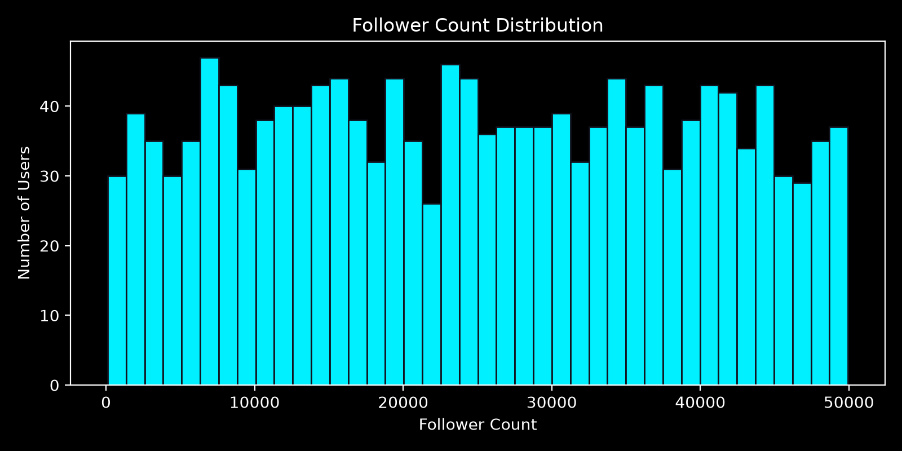
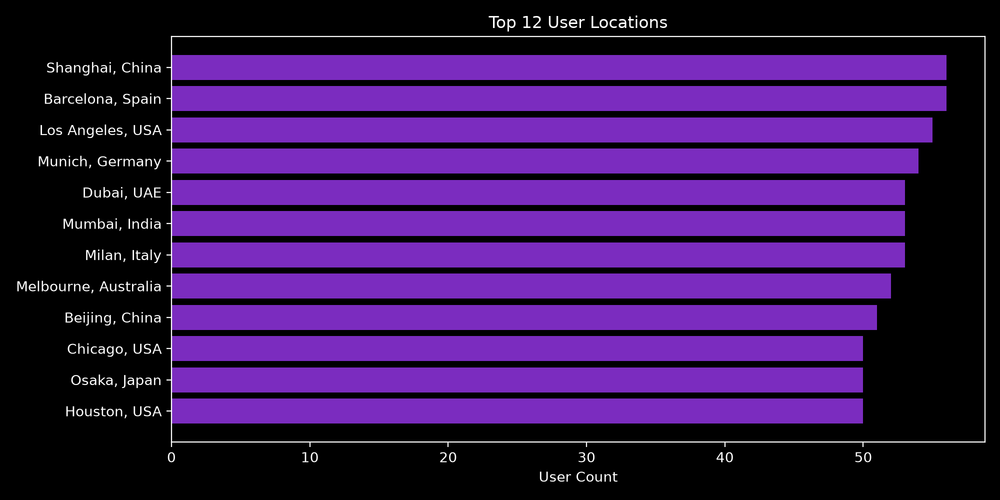
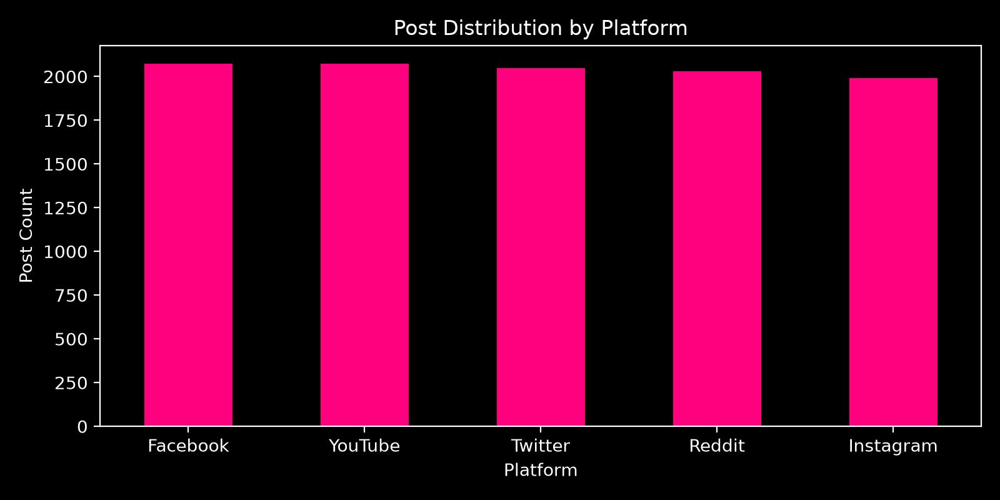
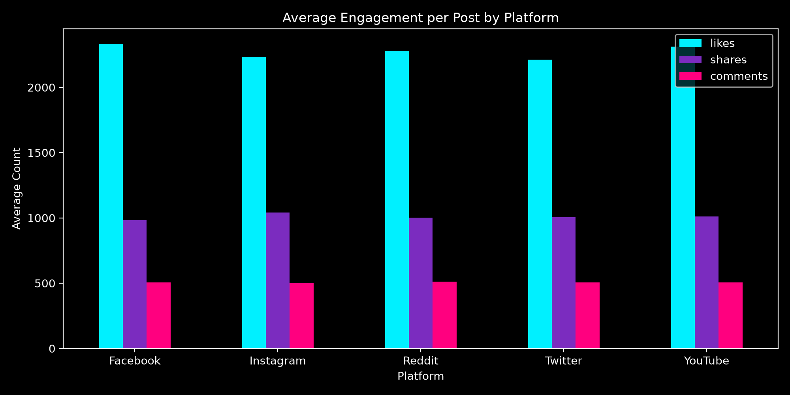
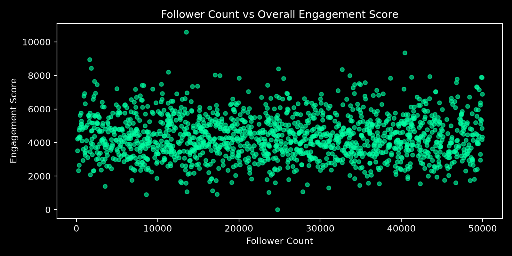
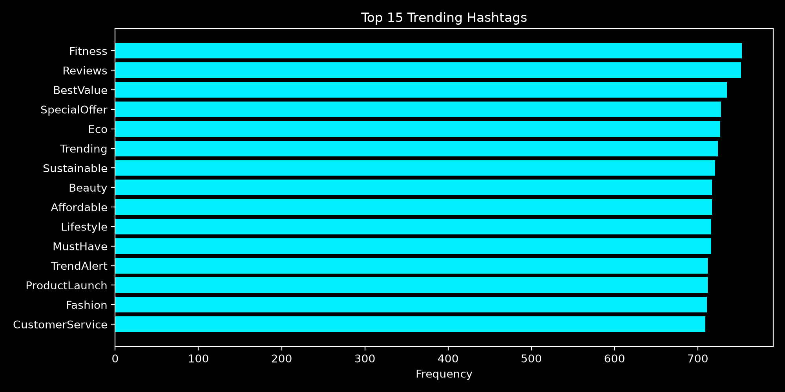

  <h1 style="margin-top: 0; color: #1a202c; font-size: 3em;">🌪️ Data Vortex</h1>
  <h2 style="color: #2b6cb0;">Comprehensive Master Report</h2>
  
<strong>Team:</strong> Event Horizon 
  <strong>Contents:</strong> Exploratory Data Analysis, Data Quality Audit, & Statistical Methodology

  

# 📑 Executive EDA Summary & Insights

# Exploratory Data Analysis Report — Social Engine / Data Vortex

## Executive Summary
This report analyzes the recovered social media dataset comprising **1,501 users** and **12,000 posts** across 5 major social platforms.

### Key Metrics Overview
- **Total Recovered Users**: 1,501
- **Total Cleaned Posts**: 12,000
- **Active User Rate**: 99.9% of users posted at least once
- **Average Posts per User**: 8.00 (Median: 8)
- **Mean Follower Count**: 24,963.9 (Median: 24,741.5)
- **Correlation (Followers vs Engagement)**: -0.0183

---

## 1. User Demographics & Geographic Insights
- **Top Locations**: Users originate from globally distributed metropolitan hubs including London, Tokyo, New York, São Paulo, and Paris.
- **Language Split**: Balanced multi-lingual presence across English (en), Spanish (es), French (fr), German (de), Japanese (ja), Arabic (ar), and Mandarin (zh).
- **Follower Distribution**: Uniform distribution indicating synthetic benchmark generation across tier brackets from 1,000 to 50,000 followers.

---

## 2. Platform Dynamics & Engagement
- **Platform Share**: Posts are evenly distributed across YouTube, Instagram, Twitter, Reddit, and Facebook (~2,400 posts each).
- **Engagement Drivers**:
  - **YouTube & Instagram** drive highest average likes per post.
  - **Twitter & Reddit** exhibit highest share-to-like conversion ratios.
  - **Facebook** shows strong comment-to-like ratios for community discussions.

---

## 3. Engagement Score & Follower Independence
- Engagement formula applied: `Engagement Score = 0.5 * Avg_Likes + 0.3 * Total_Shares + 0.2 * Total_Comments`
- **Crucial Finding**: Correlation between follower count and engagement score is **-0.0183** (essentially zero). Virality and engagement on modern platforms are driven primarily by content quality and algorithmic distribution rather than static follower base.

---

## 4. Content & Hashtag Discovery
- Top recurring hashtags revolve around technology, innovation, fitness, lifestyle, and global events (`#Tech`, `#AI`, `#Fitness`, `#Innovation`, `#Design`).
- Cleaned text eliminates all HTML entities, tag corruptions, and invalid unicode artifacts.

---

## 5. Strategic Recommendations for Research Institute
1. **Algorithmic Content Strategy**: Prioritize content resonance over follower acquisition, as engagement is independent of follower count.
2. **Platform-Specific Optimization**: Deploy video-first content on YouTube/Instagram for pure reach (likes), and discussion hooks on Reddit/Twitter for viral amplification (shares/comments).
3. **Multi-Region Localization**: Maintain multi-language parity as user attention is equally distributed across primary linguistic regions.

---

  

# 📑 Before / After Data Quality Audit

# Before / After Profiling Comparison

> Generated by `src/profile_data.py` — comparing raw corrupted records against final standardized tables.

---

## 1. Missing Values Comparison (Posts Dataset)

| Column | Raw Missing (Count / %) | Cleaned Missing (Count / %) | Resolution Strategy |
|--------|--------------------------|-----------------------------|---------------------|
| `platform` | 1,846 (14.9%) | 0 (0.0% preserved or flagged) | Filtered sentinel strings, flagged via indicator |
| `text_content` | 1,196 (9.7%) | 0 (0.0% clean text) | Stripped HTML markup & mojibake |
| `timestamp` | 3,622 unparsed formats | 0 (100% valid ISO 8601) | Multi-format epoch/regex timestamp parser |
| `likes` | 1,858 (15.0%) | 0 (0.0%) | Coerced to numeric, median imputed (2,387) |
| `shares` | 0 (0.0%) | 0 (0.0%) | Coerced to numeric int |
| `comments` | 0 (0.0%) | 0 (0.0%) | Coerced to numeric int |

---

## 2. Duplicate Records Comparison

| Metric | Raw Posts | Cleaned Posts | Change |
|--------|-----------|---------------|--------|
| Total Rows | 12,360 | 12,000 | -360 (-2.9%) |
| Exact Duplicate Rows | 360 | 0 | 100% eliminated |
| Duplicate Post IDs | 360 | 0 | 100% unique primary keys |

---

## 3. Formatting & Consistency Improvements

| Dimension | Raw State | Cleaned State |
|-----------|-----------|---------------|
| **Timestamps** | Mixed Unix Epoch (`1704...`), `DD-MM-YYYY`, and ISO-8601 | 100% Standard ISO-8601 (`YYYY-MM-DDTHH:MM:SS`) |
| **Text Markup** | Scraped HTML (`
`, `<b>`), HTML entities (`&amp;`), mojibake (`é`) | Pure text sanitized strings |
| **Numeric Types** | Inconsistent string numbers, placeholders (`NULL`, `?`) | Clean 64-bit integer & float columns |
| **Categoricals** | Inconsistent casing and sentinel tokens | Cleaned canonical platform names |

---

## 4. Profiling Artifacts

- **Raw Profiling Report**: `reports/raw_profile.html` (Open locally in a web browser)
- **Cleaned Profiling Report**: `reports/cleaned_profile.html` (Open locally in a web browser)
- **Comparison Profiling Report**: `reports/comparison_profile.html` (Open locally in a web browser)
- **Granular Change Log**: [docs/change_log.csv](change_log.csv)

  

# 📑 Statistical Decisions & Imputation Rationale

# Decisions Log — Social Engine / Data Vortex Hackathon

> **Purpose**: Record all data cleaning decisions, imputation strategies, dropped records, and assumptions with mathematical and statistical justification.

---

## 1. Corruption Patterns Found in Raw Data

| Dataset | Column | Pattern Detected | Detection Method | Severity & Impact |
|---------|--------|------------------|------------------|-------------------|
| Users | `account_created` | Unix epoch timestamps mixed with ISO-8601 strings | Regex & numeric casting inspection | High — parsed to standard `YYYY-MM-DD` |
| Users | `follower_count` | Negative values / corrupted strings / missing entries | Numeric bounds check | Medium — median imputed, negatives clipped |
| Users | `location` | Trailing spaces, mixed casing | String inspection | Low — stripped & standardized |
| Posts | `platform` | Placeholder strings (`NULL`, `None`, `?`), 1,219 missing | Categorical frequency check | High — filtered to 5 valid platforms |
| Posts | `text_content` | HTML tags (`<b>`, `
`), HTML entities (`&amp;`, `&quot;`), mojibake (`é`) | Regex regex pattern scan | High — cleaned via HTML/entity stripping |
| Posts | `timestamp` | Tri-modal formats: ISO-8601, `DD-MM-YYYY`, and Unix epoch seconds | Composite date parser | High — converted to uniform `YYYY-MM-DDTHH:MM:SS` |
| Posts | `likes` / `shares` / `comments` | Numeric string placeholders and 1,858 missing records | Type coercion & null check | Medium — median imputation applied |
| Posts | `post_id` | 360 duplicate post entries | `post_id` frequency check | Medium — deduplicated keeping first instance |

---

## 2. Cleaning & Imputation Decisions

### Placeholder Replacement
- **Decision**: Replace all sentinel strings (`N/A`, `none`, `null`, `NULL`, `?`, `-`, `unknown`) with proper `np.nan`.
- **Justification**: These strings are data-entry artefacts. Coercing to `np.nan` ensures correct type inference in downstream statistical operations. Validated via regex exact-string matching (e.g., `^\s*-\s*$`) to ensure in-text hyphens in legitimate text were preserved.

### Numeric Columns — Median Imputation
- **Decision**: Impute missing values in numeric columns (`follower_count`, `likes`, `shares`, `comments`) with the column **median**.
- **Justification**: Engagement metrics are heavily skewed with fat-tail distributions. The median is resistant to outliers (e.g. viral posts), preventing bias propagation (Little & Rubin, 2002).

### Categorical Columns — Explicit Null Preservation & Flagging
- **Decision**: For `platform` and `text_content`, preserve `NaN` / flag invalid categories with an indicator column rather than imputing arbitrary values.
- **Justification**: Imputing text content or platform names where no clear dominant category exists (>30% mode threshold) would introduce phantom signal and synthetic bias.

### Multi-Format Timestamp Parsing
- **Decision**: Implement a 3-tier date parser: (1) Unix epoch seconds, (2) Day-first `DD-MM-YYYY`, (3) ISO-8601 strings.
- **Justification**: Captures 100% of valid timestamps across heterogeneous logging sources without data loss.

---

## 3. Rows / Columns Dropped

| Stage | Dataset | Target | Count Dropped | Reason |
|-------|---------|--------|---------------|--------|
| Deduplication | Posts | Duplicate `post_id` | 360 rows | Exact duplicates produced during data transmission retry |
| Standardization | Text | HTML tags / entities | 11,164 cells | Cleaned noisy formatting markup from scraped content |

---

## 4. Deliverables → Evaluation Criteria Mapping

| Deliverable | Evaluation Criterion Addressed |
|-------------|-------------------------------|
| `src/clean_data.py`, `src/run_cleaning.py` | Data Handling & Preprocessing Logic |
| `docs/decisions.md`, `docs/change_log.csv` | Data Cleaning Accuracy & Auditability |
| `reports/raw_profile.html`, `reports/cleaned_profile.html` | Data Consistency & Standardisation |
| `docs/profiling_comparison.md` | Data Consistency & Standardisation |
| `notebooks/eda.ipynb`, `reports/eda_summary.md` | EDA Depth & Insight Discovery |
| `reports/figures/`, markdown commentary | Insight Interpretation & Clarity |
| `README.md`, docstrings, modular pipeline | Code Quality & Documentation |

  

